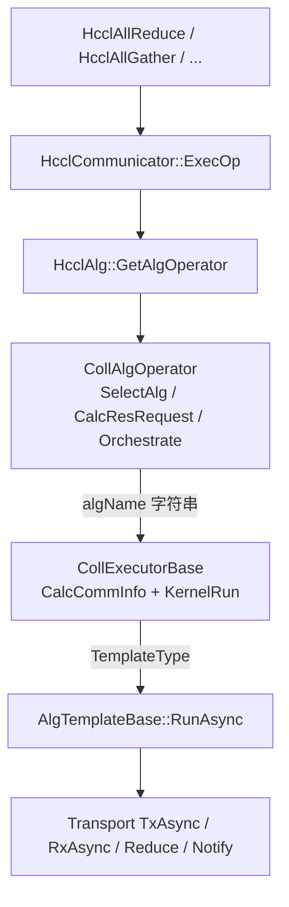
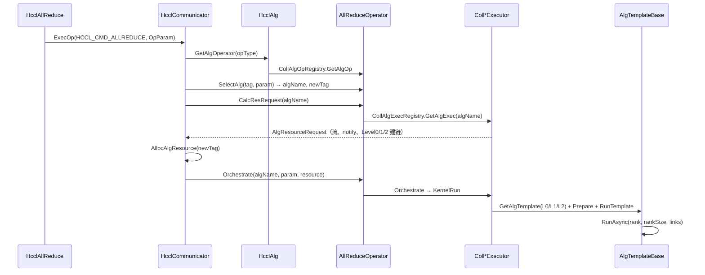

# HCCL 算法框架设计：注册、实现与调用

## 1. 分析范围与源码树

HCCL（Huawei Collective Communication Library）在开源形态上有两棵相关树：

| 仓库 | 算法根目录 | 特点 |
|---|---|---|
| **HCOMM**（完整通信基础库） | `src/algorithm/` | 三层注册：Operator / Executor / Template；137 个 Executor、100 个 Template |
| **cann-hccl**（开源子集） | `src/domain/collective_communication/algorithm/` | 仅 Operator + Executor；叶子算法 `new ExecutorBase`，无 Template 注册表 |

下文以 **HCOMM** 为准（重构目标），并注明 cann-hccl 差异。

HCOMM 算法模块规模（分析时快照）：

- `src/algorithm`：328 个 `.cc` + 527 个 `.h`
- `REGISTER_OP` × 15，`REGISTER_EXEC` × **137**，`REGISTER_TEMPLATE` × **100**
- `impl/coll_executor` ≈ 35k LOC，`base/alg_template` ≈ 33k LOC

## 2. 总体架构

算法库夹在通信框架与通信平台之间，对框架只暴露三个动作：**选择、算资源、编排**。



对应源码：

| 层次 | HCOMM 路径 |
|---|---|
| 对外 API | `src/framework/op_base/src/op_base_host.cc` |
| 通信域执行 | `src/framework/communicator/impl/hccl_communicator_host.cc` `ExecOp` |
| 算法入口 | `src/algorithm/impl/hccl_alg.cc` `HcclAlg::GetAlgOperator` |
| 算子 | `src/algorithm/impl/operator/*` + `pub_inc/coll_alg_operator.h` |
| 编排器 | `src/algorithm/impl/coll_executor/*` |
| 叶子模板 | `src/algorithm/base/alg_template/temp_*` |
| 拓扑/建链 | `src/algorithm/base/communicator/`，`CommPlane` / `CommType` |

## 3. 三层注册表

三张表都是 **静态初始化 + 单例 map/vector**，进程加载时完成绑定。热路径上只做一次查找，然后走虚函数 `RunAsync`（当前实现的主要开销来源之一，重构时要消掉叶子层虚调用）。

### 3.1 Operator 注册：`REGISTER_OP`

文件：`src/algorithm/impl/operator/registry/coll_alg_op_registry.h`

```cpp
#define REGISTER_OP(type, name, collOpBase) \
    REGISTER_OP_HELPER_1(__COUNTER__, type, name, collOpBase)
```

- Key：`HcclCMDType`（AllReduce / AllGather / ReduceScatter / …）
- Value：`DefaultOpCreator<T>` → `new T(algConfigurator, cclBuffer, dispatcher, topoMatcher)`
- 查找：`CollAlgOpRegistry::Instance().GetAlgOp(opType, …)`

已注册算子（HCOMM）：

| `HcclCMDType` | 类 |
|---|---|
| `ALLREDUCE` | `AllReduceOperator` |
| `ALLGATHER` / `ALLGATHER_V` | `AllGatherOperator` / `AllGatherVOperator` |
| `REDUCE_SCATTER` / `REDUCE_SCATTER_V` | `ReduceScatterOperator` / `ReduceScatterVOperator` |
| `BROADCAST` / `REDUCE` / `SCATTER` | `BroadCastOperator` / `ReduceOperator` / `ScatterOperator` |
| `ALLTOALL` / `V` / `VC` | `AlltoAllOperator` |
| `SEND` / `RECEIVE` / `BATCH_SEND_RECV` / `BATCH_WRITE` | 点对点与批量 |

### 3.2 Executor 注册：`REGISTER_EXEC`

文件：`src/algorithm/impl/coll_executor/registry/coll_alg_exec_registry.h`

```cpp
#define REGISTER_EXEC(tag, name, collExecBase) \
    REGISTER_EXEC_HELPER_1(__COUNTER__, tag, name, collExecBase)
```

- Key：**字符串算法名**，例如 `"AllReduceRingFor91093Executor"`
- Value：`DefaultExecCreator<T>` → `new T(dispatcher, topoMatcher)`
- Operator 的 `SelectAlg` 产出这个字符串；`CalcResRequest` / `Orchestrate` 再用它取 Executor

这是当前组合爆炸的主因：每增加一种「芯片 × 拓扑 × 数据量 × 工作流（图/单算子）× 是否 AIV」几乎就要新写一个 Executor 类并 `REGISTER_EXEC`。

### 3.3 Template 注册：`REGISTER_TEMPLATE`（HCOMM 独有）

文件：`src/algorithm/base/alg_template/alg_template_register.h`

```cpp
#define REGISTER_TEMPLATE(type, algTempBase) \
    REGISTER_TEMPLATE_HELPER(__COUNTER__, type, algTempBase)
```

- Key：`TemplateType` 枚举（`TEMPLATE_ALL_REDUCE_RING`、`TEMPLATE_REDUCESCATTER_NHR`、…）
- Value：`DefaultTemplateCreator<T>` → `new T(dispatcher)`
- Executor 在 `KernelRun` 里：`AlgTemplateRegistry::Instance().GetAlgTemplate(type, dispatcher)`，再 `Prepare` + `RunAsync`

cann-hccl 没有这张表，叶子是 `ExecutorBase` 派生类，由 Executor 直接 `new`。

## 4. 完整调用链

以 `HcclAllReduce` 为例（AllGather / ReduceScatter 同构）：



`ExecOp` 关键步骤（`hccl_communicator_host.cc`）：

1. `implAlg_->GetAlgOperator(opType)`
2. `algOperator->SelectAlg(..., algName, algDesc, newTag)`
3. 按 `newTag` 查/建资源：`CalcResRequest` → `AllocAlgResource`
4. `algOperator->Orchestrate(algName, opParam, resMap_[newTag])`

`CollAlgOperator::Orchestrate` 本身不做算法，只分发：

```cpp
executor_ = CollAlgExecRegistry::Instance().GetAlgExec(algName, dispatcher_, topoMatcher_);
return executor_->Orchestrate(param, algResource);
```

叶子执行统一入口：

```cpp
HcclResult CollExecutorBase::RunTemplate(
    const std::unique_ptr<AlgTemplateBase> &tempAlg, const SubCommInfo &commInfo)
{
    return tempAlg->RunAsync(commInfo.localRank, commInfo.localRankSize, commInfo.links);
}
```

## 5. 算法选择（AlgType × 设备 × 数据量）

### 5.1 三级 AlgType

`src/algorithm/pub_inc/common.h`：

```cpp
struct AlgType {
    AlgTypeLevel0 algoLevel0;  // 节点内：MESH / SINGLE_RING / DOUBLE_RING / ...
    AlgTypeLevel1 algoLevel1;  // 节点间：RING / NHR / NB / HD / AHC / PIPELINE / ...
    AlgTypeLevel2 algoLevel2;  // 超节点间：RING / NHR / NB / HD / PIPELINE
};
```

环境变量 `HCCL_ALGO` 语法：

```
level0:NA;level1:ring;level2:NHR
AllReduce=level0:fullmesh;level1:pipeline
```

解析路径：`ParseHcclAlgo`（`env_config.cc`）→ `alg_env_config.cc` → `AlgConfigurator::SetAlgoLevel0/1/2`。

cann-hccl 仍使用按 bit 打包的 `AlgType` 枚举（每级 8 bit），选择逻辑嵌在 `hcclImpl` 里。

### 5.2 Operator 内二次选择

`AllReduceOperator::SelectAlg` 先按芯片分支：

- `SelectAlgfor310P3` / `310P3DUO` / `910A` / **`910B`** / **`91093`** / Mix

910B 上再叠加：是否 Mesh 拓扑、数据量、AIV、确定性、AHC、inline reduce，最终落到一个 **Executor 字符串**。例如：

- `"AllReduceMeshOpbaseLoopExecutor"`
- `"AllReduceRingFor91093Executor"`
- `"AlignedAllReduceDoubleRingFor91093Executor"`

`CollAlgOperator::AutoSelectAlgTypeLevel1` 可按时延模型在 RING / NHR / PIPELINE / HD 之间自适应（仅当 level1 为 DEFAULT）。

### 5.3 Executor 描述符对 level1/2 的约束

例如 `CollAllReduceRingFor91093Executor` 构造时声明自己支持的 L1/L2：

```cpp
desc_.level1SupportedAlgos = { NHR, NB, RING, AHC, AHC_BROKE };
desc_.level2SupportedAlgos = { NHR, NB, RING, HD };
```

`SetAlgType` 会把不支持的级别打回该列表的第一项。这已经是「运行时组合」——但 **KernelRun 里仍然手写一长串 if/else 去 GetAlgTemplate**。

## 6. 分层通信域（真正的「分层算法」骨架）

`src/algorithm/base/communicator/comm_utils.h`：

| `CommPlane` | 含义 | 典型建链 `CommType` |
|---|---|---|
| `COMM_LEVEL0` | 服务器内 | `COMM_TAG_MESH` / `RING_INNER` / `HCCS_PLUS_SIO` |
| `COMM_LEVEL1` | 服务器间（超节点内） | `RING_INNER` / `NONUNIFORM_HIERARCHICAL_RING` / `HALVING_DOUBLING` / `MESH` |
| `COMM_LEVEL1_AHC` | 非对称超节点 | `ASYMMETRIC_HIERARCHICAL_CONCATENATE` |
| `COMM_LEVEL2` | 超节点间 | 同 L1 的稀疏算法 |
| `COMM_LEVEL0_ANYPATH_{SDMA,RDMA}` | 多通道并发 | 双平面 |

**标准三步 AllReduce**（`CollAllReduceRingFor91093Executor::KernelRun`）：

1. **L0 ReduceScatter**（节点内，单环或多环 / aligned double-ring）
2. **L1 AllReduce**（节点间；若有多超节点则变为 L1 RS → L2 AR → L1 AG）
3. **L0 AllGather**

这是分层算法的唯一编排形状。Mesh / Ring / DoubleRing 只替换第 1、3 步的 L0 引擎；NHR / Ring / NB / HD / AHC 只替换第 2 步的 L1/L2 引擎。当前源码把这个形状复制进了几十个 `Coll*For91093Executor`。

## 7. 类层次

```
CollAlgOperator
  └─ AllReduceOperator / AllGatherOperator / ...

CollExecutorBase
  └─ CollNativeExecutorBase     // CalcLevel0/1/2CommInfo, KernelRun*
        └─ CollCommExecutor     // MultiRing*, PrepareMultiRingSlice, AnyPath
              └─ CollAllReduceExecutor / CollAllGatherExecutor / ...
                    └─ CollAllReduceRingFor91093Executor 等 137 个具体类

AlgTemplateBase   (cann-hccl: ExecutorBase)
  ├─ AllReduceRing          // 内部再组合 RS_RING + AG_RING
  ├─ ReduceScatterNHR : NHRBase
  ├─ AllGatherMesh
  ├─ AlignedReduceScatterDoubleRing
  └─ AHCAlgTemplateBase     // 已有的组内/组间组合
```

已有的两处「组合」示范（重构应对齐它们，而不是再复制）：

1. **`AllReduceRing::RunAsync`** = `ReduceScatterRing` + `AllGatherRing`（通过 Template 注册表取子模板）
2. **`AHCAlgTemplateBase`** = 组内实例 + 组间实例（`RunInstance` 再取子 TemplateType）

## 8. 现框架的结构性问题（驱动重构）

1. **笛卡尔积落地成类**：拓扑 × 集合操作 × 芯片 × 工作流 × 通道数 ≈ 上百个近拷贝 `.cc`
2. **字符串当类型**：`algName` 与 `TemplateType` 两套名字空间，新增算法要改选择器、注册宏、CMake、测试
3. **分层骨架手写 N 遍**：91093 / zerocopy / V 算子 / mesh 的 `KernelRun` 结构相同，只有 L0 launcher 不同
4. **热路径虚函数**：`AlgTemplateBase::RunAsync` 为虚函数；step 循环里再虚调用 `Transport`
5. **CLOS 被误当成算法**：互联类型在 `RankGraph`，集合算法仍是 ring/nhr/mesh（见分析文档）

下一篇：[02-algorithm-analysis.md](02-algorithm-analysis.md)
