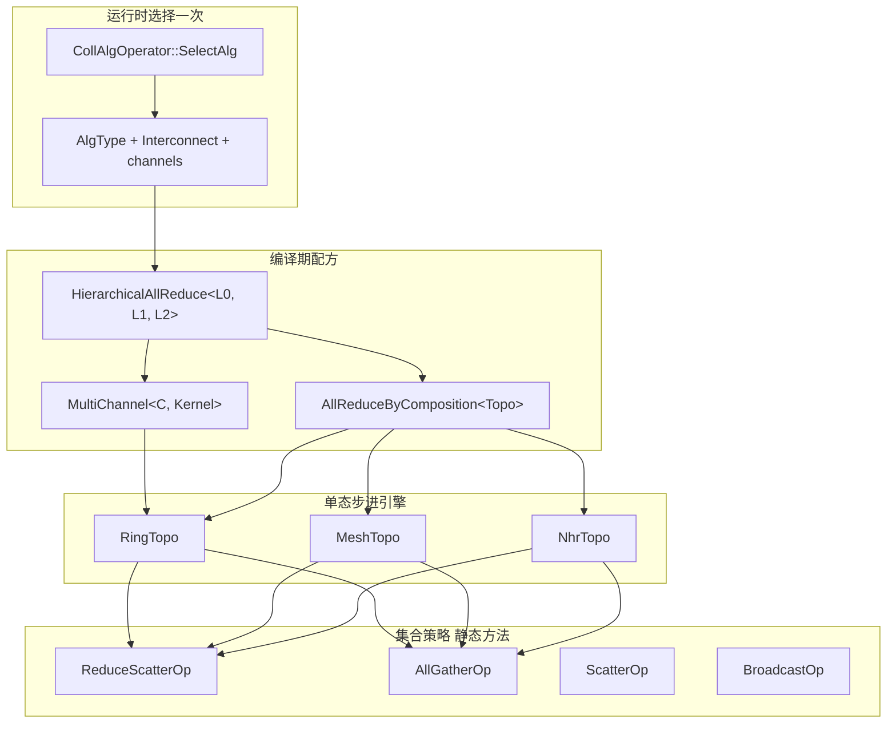

# 重构设计：C++ 模板化 + 组合

## 1. 目标

在 **不降低性能**（热路径无新增虚调用、无额外内存往返、可内联步进）的前提下：

1. 把「拓扑步进」和「集合语义」拆开，用 **类型组合** 代替类拷贝
2. 把 CLOS 建模为 **互联策略**，把 Clos+Mesh 建模为 **分层配方**
3. 把 double-ring / 8P 多环 / AnyPath 建模为 **MultiChannel**
4. 把 91093 三步 AllReduce 建模为 **Hierarchical\<L0, L1[, L2]\>**
5. 新增一种拓扑或一种集合操作时，只加 **一个引擎或一个策略**，而不是 N 个 Executor

可运行的语义原型：[`hccl_alg_refactor/`](../../hccl_alg_refactor/README.md)（51 项 CPU 测试，覆盖本文所有家族）。

## 2. 设计原则

| 原则 | 做法 | 禁止 |
|---|---|---|
| 编译期组合 | CRTP / policy class / `using Kernel = TopologyKernel<Topo, Op>` | 热路径 `virtual SendSlice()` |
| 运行期只选一次 | Operator 仍按数据量/拓扑选 **配方**（L0/L1/channel） | 每 step 查表、`std::function` 回调 |
| 零额外拷贝 | 策略只计算 chunk 下标，搬运仍走现有 Transport | 策略层再做一遍 D2D |
| 互联 ≠ 算法 | `ClosInterconnect` / `OnChipMeshInterconnect` | `ClosAllReduce` 内核类 |
| 组合优先 | `AllReduce = RS ∘ AG`，`DoubleRing = MultiChannel<2, Ring>` | 再写一份 AR/DR 步进 |

源码单位从笛卡尔积变成求和：

```
旧：Collective × Topo × Variant ≈ 7 × 6 × 4 = 168 个近独立实现
新：TopoEngine(3) + OpPolicy(5) + Compositor(3) + Interconnect(2) = 13 个单位
```

芯片 / AIV / 图模式差异下沉为 **非热路径属性**（资源计算、stream 数、DMA reduce 开关），不再复制步进内核。

## 3. 分层视图



一次 910B 多机 AllReduce 的类型展开：

```cpp
using L0I = OnChipMeshInterconnect;          // COMM_TOPO_1DMESH
using L1I = ClosInterconnect;                // COMM_TOPO_CLOS
using L0  = DefaultTopoFor<L0I, MeshTopo, RingTopo>;  // MeshTopo
using L1  = DefaultTopoFor<L1I, MeshTopo, NhrTopo>;   // NhrTopo（大规模）或 RingTopo
using Kernel = HierarchicalAllReduce<L0, L1>;
// KernelRun ≡ L0 RS → L1 AR(=RS∘AG) → L0 AG
```

910_93 双环超节点：

```cpp
using L0 = MultiChannel<2, TopologyKernel<RingTopo, ReduceScatterOp>>;
using L1 = TopologyKernel<NhrTopo, /*AR via composition*/>;
using L2 = TopologyKernel<RingTopo, /*AR*/>;
```

## 4. 核心抽象

### 4.1 OpPolicy（集合语义）

只描述「这一片收到后干什么、步进时收发哪一片」，不知道邻居是谁。

```cpp
struct ReduceScatterOp {
    static constexpr bool kReduce = true;
    static int tx_chunk(int rank, int n, int step);  // HCCL: rank-1-step
    static int rx_chunk(int rank, int n, int step);  // HCCL: rank-2-step
};
struct AllGatherOp {
    static constexpr bool kReduce = false;
    static int tx_chunk(int rank, int n, int step);  // HCCL: rank-step
    static int rx_chunk(int rank, int n, int step);  // HCCL: rank-1-step
};
```

Broadcast / Scatter / Reduce 是同一接口加 root 门控。**全部 static，可内联。**

落地到 HCOMM 时，`tx_chunk` 映射为现有 `Slice` 下标，`kReduce` 选择 `Sender` vs `Reducer`，不改变 Transport 调用序列。

### 4.2 TopologyEngine（步进日程）

```cpp
struct RingTopo {
    template<typename Op>
    static int steps(int n) { return n - 1; }

    template<typename Op>
    static StepPlan plan(int rank, int n, int step) {
        return { /* send_to = rank+1, recv_from = rank-1,
                    tx = Op::tx_chunk(...), rx = Op::rx_chunk(...) */ };
    }
};
```

`StepPlan` 允许 NHR 一步多片（`tx_chunks` / `rx_chunks` 为向量），与 `InterServerAlgoStep` 同构。

```cpp
template<typename Topo, typename Op>
struct TopologyKernel {
    static void run(/* links, slices, stream */) {
        for (int s = 0; s < Topo::template steps<Op>(n); ++s) {
            auto p = Topo::template plan<Op>(rank, n, s);
            // 直接调用现有 TxAsync/RxAsync/Reduce — 无虚 Op
        }
    }
};
```

编译后 `TopologyKernel<RingTopo, ReduceScatterOp>` 与手写 `ReduceScatterRing::RunReduceScatter` 是同一循环，只是片号计算来自策略。

### 4.3 InterconnectPolicy（Mesh vs Clos）

```cpp
struct OnChipMeshInterconnect {
    static constexpr bool kFullyConnected = true;
    static constexpr bool kPreferSparseAlgo = false;  // 选 Mesh
};
struct ClosInterconnect {
    static constexpr bool kFullyConnected = true;     // 全双分，任意置换
    static constexpr bool kPreferSparseAlgo = true;   // 选 Ring/NHR/HD
};

template<class I, class Dense, class Sparse>
using DefaultTopoFor = std::conditional_t<I::kPreferSparseAlgo, Sparse, Dense>;
```

互联策略 **不进入 step 循环**。它只影响：

- 默认 Topo 选择（上面的 `DefaultTopoFor`）
- 建链 `CommType`（`COMM_TAG_MESH` vs `RING` / `NHR`）
- 资源：mesh 需要 `rankSize-2` 条从流，ring 需要 1 条

这对应 `RankGraph` 的 L0=1DMESH、L1=CLOS，而不是新算法。

### 4.4 AllReduce = 组合，不是新引擎

```cpp
template<typename Topo>
struct AllReduceByComposition {
    static void run(...) {
        TopologyKernel<Topo, ReduceScatterOp>::run(...);
        TopologyKernel<Topo, AllGatherOp>::run(...);
    }
};
```

与现网 `AllReduceRing` / `AllReduceNHR` / `AllReduceNB` 行为一致。Oneshot 小数据是 **另一个 Op 或另一个 Topo 特化**（`NhrOneshotTopo`），用偏特化而不是复制类。

### 4.5 MultiChannel / Double-Ring

```cpp
template<int C, typename Kernel, bool OppositeOdd = true>
struct MultiChannel {
    static void run(...) {
        auto slices = split_payload(C);          // 现网 PrepareMultiRingSlice
        for (int c = 0; c < C; ++c) {
            auto order = ring_order(c, OppositeOdd);  // 奇通道反向
            launch_on_stream(c, Kernel{}, slices[c], order);
        }
        sync_channels();  // 现网 LocalNotify
    }
};

using DoubleRingRS = MultiChannel<2, TopologyKernel<RingTopo, ReduceScatterOp>>;
using Ring8P       = MultiChannel<4, TopologyKernel<RingTopo, ReduceScatterOp>>;
```

AnyPath = `MultiChannel<2, Kernel>` 但两个通道分别绑 `COMM_LEVEL0_ANYPATH_SDMA` 与 `_RDMA`（通道策略 = 传输平面，而不是反向环）。

### 4.6 Hierarchical（分层 + Clos+Mesh）

```cpp
template<typename L0Topo, typename L1Topo>
struct HierarchicalAllReduce {
    static void run(...) {
        // 与 CollAllReduceRingFor91093Executor::KernelRun 同序
        foreach_server:  TopologyKernel<L0Topo, ReduceScatterOp>::run(L0);
        foreach_color:   AllReduceByComposition<L1Topo>::run(L1);  // 或 RS+L2+AG
        foreach_server:  TopologyKernel<L0Topo, AllGatherOp>::run(L0);
    }
};

using ClosPlusMesh = HierarchicalAllReduce<MeshTopo, NhrTopo>;
using ClosPlusMeshSmall = HierarchicalAllReduce<MeshTopo, RingTopo>;
```

L2 超节点用偏特化或第三个模板参数，避免再复制一份 91093 Executor。

零拷贝拆成 `KernelRunIntraServerPre / InterServer / IntraServerPost` 的现有接口，正好对应上面三行，应保留函数边界、换成模板调用。

## 5. 家族映射（需求对照）

| 需求家族 | 重构后的类型 | 现网对应 |
|---|---|---|
| **Mesh** | `TopologyKernel<MeshTopo, Op>` | `AllGatherMesh*` / `ReduceScatterMesh*` |
| **Clos** | `ClosInterconnect` + 默认 `RingTopo`/`NhrTopo` | `COMM_TOPO_CLOS` + L1 模板 |
| **Clos+Mesh** | `HierarchicalAllReduce<MeshTopo, NhrTopo或RingTopo>` | 910B 多机默认 |
| **Ring** | `TopologyKernel<RingTopo, Op>` | `*Ring.cc` |
| **Double-Ring** | `MultiChannel<2, RingKernel>` | aligned / NP_DOUBLE_RING |
| **NHR** | `TopologyKernel<NhrTopo, Op>` | `NHRBase` + `GetStepInfo` |
| **多 Channel** | `MultiChannel<C, Kernel>` | `MultiRing*` / AnyPath |
| **分层** | `HierarchicalAllReduce<L0,L1[,L2]>` | `Coll*For91093Executor::KernelRun` |

HD / NB / AHC / Pipeline 同一套接口即可接入：HD/NB 是新 `Topo`，AHC/Pipeline 是新 `Compositor`。第一期不强制改它们，但不要再按集合操作复制。

## 6. 性能约束与验证方法

### 6.1 必须保持

- step 循环内：与现网相同的 `TxAck → TxAsync → RxAsync → (Reduce) → WaitDone` 顺序
- slice 切分对齐：`HCCL_MIN_SLICE_ALIGN*`、double-ring 的 aligned 约束仍由 **切片器** 负责，不是引擎
- 多 stream 重叠：Mesh / Double-ring 的从流数量公式不变，只是从「Executor 子类字段」变成 Channel 策略的 `stream_num()`
- L1 自适应：仍用现有 `AutoSelectAlgTypeLevel1`；选中后绑定一个具体 `TopologyKernel<…>` 类型

### 6.2 禁止引入

- 热路径虚函数（Topo / Op）
- 每 step 堆分配 `std::vector`（`StepPlan` 在设备实现里改为固定上限数组，NHR 的 `nSlices` 有界）
- 额外 D2D（组合 AR 的 RS 输出必须仍是 AG 的输入，与现网 `AllReduceRing` 同 buffer 约定）

### 6.3 预期性能

模板特化后，`Ring+ReduceScatter` 应与手写 `ReduceScatterRing` **生成同类指令流**。差异只允许出现在：

- 片号计算是否内联（应当更好）
- 注册表少一次 `GetAlgTemplate` 间接层（L0 可直接调特化函数）

建议在合入现网前做：

1. 单测：本仓库 `make -C hccl_alg_refactor test`（语义）
2. 对拍：同一 OpParam 下旧 Executor vs 新 Kernel 的 Task 序列（SQE dump / profiler plane）
3. 性能：910B 单机 Mesh、910B 多机 Clos+Mesh、910_93 双环、L1 NHR 四条基线带宽/时延

## 7. 与现有三层注册表的衔接

**不推翻 Operator 注册。** `REGISTER_OP` 仍按 `HcclCMDType` 分发。变化在 Executor / Template：

### 7.1 过渡期（推荐）

保留 `REGISTER_EXEC("AllReduceRingFor91093Executor", …)` 字符串，避免 `SelectAlg` 大爆炸。Executor 类变成 **一行 using + 资源计算策略**：

```cpp
using CollAllReduceRingFor91093Executor =
    HierarchicalExecutor< /* 资源策略 91093 Ring */
        MultiChannel<2, TopologyKernel<RingTopo, ReduceScatterOp>>,
        AllReduceByComposition<NhrTopo>
    >;
REGISTER_EXEC("AllReduceRingFor91093Executor", AllReduceRingFor91093,
              CollAllReduceRingFor91093Executor);
```

旧名字继续给选择器与 profiler 用。

### 7.2 Template 注册表

`REGISTER_TEMPLATE` 可逐步收缩：同一 `Topo×Op` 只注册一次，AR 不再单独注册。自定义算法仍走 `TEMPLATE_CUSTOM_BEGIN`。

### 7.3 选择器

`SelectAlgfor910B/91093` 从「返回一个长类名」改为「返回配方」：

```text
{ l0: Mesh, l1: NHR, channels: 1, hierarchical: true }
```

再由一张 **编译期表**（见原型 `KernelPick`）映射到类型。运行时只 switch 一次配方枚举。

## 8. 目录建议（合入 HCOMM 时）

```
src/algorithm/
  base/
    topo/                 # RingTopo, MeshTopo, NhrTopo, HdTopo, NbTopo
      ring.hpp
      mesh.hpp
      nhr.hpp
    op/                   # ReduceScatterOp, AllGatherOp, ...
    interconnect/         # Clos, OnChipMesh, RingLinks
    compose/
      hierarchical.hpp
      multi_channel.hpp
      allreduce.hpp
    transport_adaptor.hpp # 把 StepPlan 接到现有 LINK
  impl/
    executor/
      hierarchical_executor.hpp   # 取代 N 个 Coll*For91093Executor
      resource_policy_91093.hpp   # stream/notify/DMA 开关
```

叶子 `temp_*/*.cc` 第一期改为 **thin wrapper**（调用 `TopologyKernel::run`），第二期删除。

## 9. 落地步骤

1. **抽 Ring 引擎 + RS/AG 策略**，对拍 `ReduceScatterRing` / `AllGatherRing` / `AllReduceRing` Task 序列  
2. **抽 HierarchicalAllReduce**，替换 `CollAllReduceRingFor91093Executor::KernelRun` 的 if/else 模板选择（L1 仍运行时枚举）  
3. **Mesh 引擎** 替换节点内 mesh RS/AG；910B Clos+Mesh 变成 `Hierarchical<Mesh, L1>`  
4. **NHR 引擎** 把 `GetStepInfo` 搬进 `NhrTopo::plan`，删掉各集合一份的 step 循环  
5. **MultiChannel** 吞掉 `MultiRing*` 与 aligned double-ring  
6. 资源计算（`CalcLevel0/1/2CommInfo`）按 Interconnect + Topo 的 `CommType` 表驱动，删除各 Executor 里复制的 `Calc*CommInfo`

每一步都保持旧 `REGISTER_EXEC` 名字，便于灰度。

## 10. 原型已验证的不变量

`make -C hccl_alg_refactor test`（51 passed）：

- Ring / Mesh / NHR 的 RS、AG、AR（AR 仅由 RS∘AG 组合）在 n=2..8（NHR 含非 2 幂）上数值正确
- Double-ring：两通道对半切分 + 奇通道反向环序，RS 与 AR 正确
- Clos+Mesh 分层：L0 Mesh × L1 Ring/NHR，n=4/8 分层 AllReduce 正确
- `DefaultTopoFor<OnChipMesh>` → Mesh，`DefaultTopoFor<Clos>` → Ring
- `static_assert(!is_polymorphic<RingTopo/MeshTopo/NhrTopo/Op>)`：热路径类型无虚表

原型是 CPU 锁步模拟，用来钉住 **组合语义**。合入 HCOMM 时只需把 `commit_step` 换成现有 `LINK::TxAsync/RxAsync`，不要改 Topo/Op 的片号公式。
