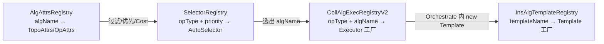
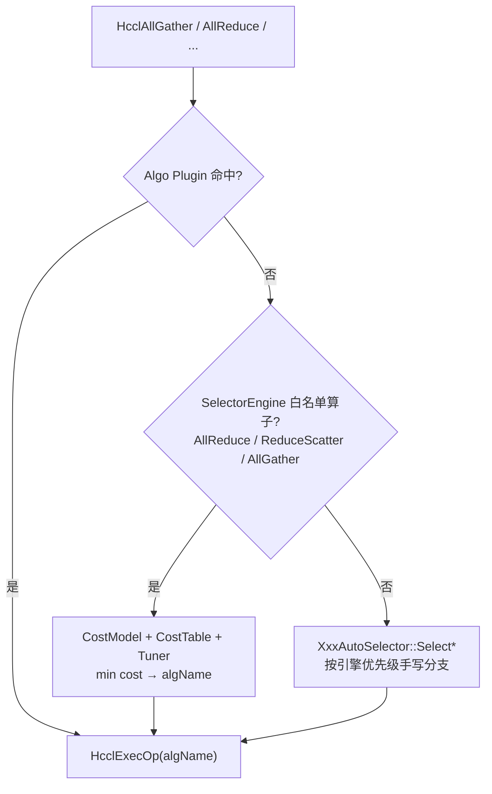
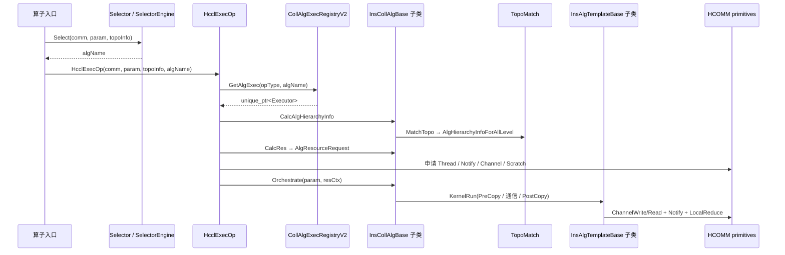

# HCCL 集合通信算法框架设计文档

> 基于 `cann/hccl`（算子仓）与 `cann/hcomm`（通信基础仓）源码分析。
> 目标：把现有算法的**注册、实现、调用**链路讲清楚，作为重构设计的基线。

---

## 1. 范围与结论

HCCL 当前不是“一个算法类对应一次通信”，而是三层解耦：

1. **Selector**：按拓扑、数据量、引擎、CostModel 选出算法名字符串。
2. **Executor**：按算法名实例化执行器，负责拓扑分层、资源申请、编排（Sole / Sequence / Parallel / Concurrent / OmniPipe）。
3. **Template**：在单个子通信域上生成通信计划并下发 Send/Recv/Reduce/Notify。

主干已经部分使用 C++ 模板（`Executor<TopoMatch, Temp0, Temp1, ...>`），但**模板参数绑的是整类 Template，而不是拓扑原语**。Mesh / CLOS / NHR 的通信步、切片、多 Channel 逻辑在 AICPU / CCU / AIV 以及 AllGather / ReduceScatter / AllReduce 等算子间大量复制。

量化基线（HCCL `src/ops/`）：

| 指标 | 规模 |
|------|------|
| 算子实现总行数（`.h`/`.cc`） | 约 16.7 万行，其中 `op_common` 3.5 万、AllReduce 2.3 万、ReduceScatter 2.1 万 |
| Executor 相关文件 | 153 个，Executor 类约 75 个，编排代码约 4.4 万行 |
| Template 相关文件 | 429 个，约 6.2 万行 |
| V2 执行器注册点 | `REGISTER_EXEC_V2*` 约 119 处 |
| 算法属性注册 | `REGISTER_ALG_ATTRS` 约 196 处 |
| 选择器 | 38 个文件，每算子一份 AutoSelector + 公共 `SelectorEngine` |

官方已有试验性 RFC（`docs/zh/rfcs/0003-executor-template-refactor.md`）与 `experimental/ops/op_common/recursive_executor/`：用**运行时算法树 + 通用解释器**替代 50+ 特化 Executor。本系列第二份文档走另一条路径：**编译期 C++ 模板化 + 组合**，避免解释器热路径开销。

---

## 2. 软件分层与职责

```text
AI 框架 / 用户
    │  HcclAllGather / HcclAllReduce / ...
    ▼
┌──────────────────────────────────────────────────────────┐
│ HCCL 集合通信算子仓 (cann/hccl)                           │
│  ops/<op>/*.cc          算子入口、参数校验                 │
│  ops/<op>/selector      每算子 AutoSelector               │
│  ops/op_common/selector SelectorEngine + CostModel        │
│  ops/<op>/algorithm/executor   编排执行器                  │
│  ops/<op>/algorithm/template   单层算法模板 (AICPU/CCU/AIV)│
│  ops/op_common/algorithm/topo_match  拓扑分层匹配          │
└──────────────────────────┬───────────────────────────────┘
                           │ dlsym (hcomm_dlsym)
                           ▼
┌──────────────────────────────────────────────────────────┐
│ HCOMM 通信基础仓 (cann/hcomm)                             │
│  communicator / rank_graph   通信域、RankGraph、拓扑       │
│  resource                    Thread / Channel / CommMem   │
│  primitives                  Write/Read/Reduce/Notify     │
│  algorithm/base (legacy)     Ring/Double-Ring/NHR/AHC 模板│
└──────────────────────────────────────────────────────────┘
```

职责边界：

| 层 | 回答的问题 | 代码位置 |
|----|------------|----------|
| 算子入口 | 这是哪条原语、参数是否合法 | `src/ops/<op>/<op>.cc` |
| Selector | 这次调用用哪条算法名 | `selector/` + `SelectorEngine` |
| TopoMatch | 通信域如何切成逐层子通信域 | `op_common/algorithm/topo_match/` |
| Executor | 多层如何串并行、资源怎么申请 | `algorithm/executor/` |
| Template | 一层内和谁通信、搬哪些切片 | `algorithm/template/` |
| HCOMM | Channel/Thread/内存如何落地 | `hcomm` primitives + resource |

HCCL 通过 `dlsym` 调 HCOMM，两仓独立编译。HCOMM 内仍保留一套旧算法栈（`CollAlgOperator` + `coll_executor` + `alg_template`），主要服务 A2/A3 的 Ring / Double-Ring / AHC 路径；Ascend 950 新路径以 HCCL `src/ops` 的 V2 Executor/Template 为主。

---

## 3. 注册框架

注册全部是**静态初始化期**写入全局单例。Host 库与 AICPU 内核各自有一份表，靠同名字符串对齐，算法树不需要序列化。

### 3.1 四张注册表



| 表 | 头文件 | 键 | 值 | 注册宏 |
|----|--------|----|----|--------|
| Selector | `selector_registry.h` | `HcclCMDType` + 优先级 | `AutoSelectorBase*` | `REGISTER_SELECTOR_BY_OPTYPE(op, 18, XxxAutoSelector)` |
| AlgAttrs | `alg_attrs_registry.h` | 算法名 | `AlgAttrs`（拓扑约束、引擎、自定义 filter） | `REGISTER_ALG_ATTRS(Name, topo.xxx=...;)` |
| Executor V2 | `coll_alg_v2_exec_registry.h` | `HcclCMDType` + 算法名 | `InsCollAlgBase*` 工厂 | `REGISTER_EXEC_V2` / `_MULTI` / `_BY_TWO_TEMPS` |
| Template V2 | `alg_v2_template_register.h` | 字符串名 | `InsAlgTemplateBase*` 工厂 | `REGISTER_TEMPLATE_V2("InsTemp...", Cls)` |
| Executor V1 | `coll_alg_exec_registry.h` | 算法名 | `ExecutorBase*` | `REGISTER_EXEC`（旧路径，ScatterRing 等） |
| Template V1 | `alg_template_register.h` | `TemplateType` 枚举 | `AlgTemplateBase*` | `REGISTER_TEMPLATE`（Mesh/Ring/NHR/NB） |

HCOMM 侧另有 `CollAlgOpRegistry`（`REGISTER_OP`），按 `HcclCMDType` 注册 `CollAlgOperator`，再由 Operator 内部按 `algName` 选 `coll_executor`。这是旧栈，不参与 950 V2 CostModel 选择。

### 3.2 Executor 注册宏：把拓扑匹配器和 Template 编进类型

当前 V2 已经在用 C++ 模板做**类型级组合**，但粒度是“整颗 Template 类”：

```cpp
// 单层：Executor<TopoMatch, Template>
REGISTER_EXEC_V2(
    HcclCMDType::HCCL_CMD_ALLGATHER,
    AicpuAllGatherSoleMesh,
    InsV2AllGatherSoleExecutor,
    TopoMatchOneLevel,
    InsTempAllGatherMesh1D);

// 两层 Sequence / Parallel：Executor<TopoMatch, Temp0, Temp1>
REGISTER_EXECUTOR_BY_TWO_TEMPS(
    HcclCMDType::HCCL_CMD_ALLGATHER,
    AicpuAllGatherSequenceMeshNHR,
    InsV2AllGatherSequenceExecutor,
    TopoMatchTwoLevel,
    InsTempAllGatherMesh1D,
    InsTempAllGatherNHR);

// 任意多层：Executor<TopoMatch, Temp...>
REGISTER_EXEC_V2_MULTI(
    type, name, InsV2XxxOmniPipeExecutor, TopoMatchThreeLevel,
    Temp0, Temp1, Temp2);
```

宏展开后做两件事：

1. `CollAlgExecRegistryV2::Register(opType, "AicpuAllGatherSoleMesh", DefaultExecCreatorV2<InsV2AllGatherSoleExecutor<TopoMatchOneLevel, InsTempAllGatherMesh1D>>)`
2. `AddAlgToAllAlgos(...)` 把算法名、Executor 类名、Template 类名写入 CostModel 候选集

随后紧跟 `REGISTER_ALG_ATTRS`，声明该算法能跑在哪些 Level0 拓扑上：

```cpp
REGISTER_ALG_ATTRS(
    AicpuAllGatherSoleMesh,
    topo.maxTopoLevelNum = 1;
    topo.supportLevel0Topos = LEVEL0_TOPO_MESH_1D | LEVEL0_TOPO_MESH_1D_CLOS;
    topo.requireAllMeshConnected = true;
    topo.topoCustomCheck = [](const TopoInfoWithNetLayerDetails* t) { ... };
);
```

Level0 拓扑 bitmask（`alg_attrs.h`）：

| 常量 | 对应 `Level0Shape` | 含义 |
|------|--------------------|------|
| `LEVEL0_TOPO_CLOS = 0x01` | `CLOS` | 机内/层内 CLOS（无全互连 Mesh） |
| `LEVEL0_TOPO_MESH_1D = 0x02` | `MESH_1D` | 1D Mesh 全互连 |
| `LEVEL0_TOPO_MESH_1D_CLOS = 0x04` | `MESH_1D_CLOS` | Mesh + CLOS 混合（UBX / PCIE-SW） |
| `LEVEL0_TOPO_ANY = 0xFF` | — | 不限制 |

### 3.3 算法命名约定

算法名是 Selector 与 Executor 之间的**唯一纽带**，编码了引擎、算子、编排、拓扑原语：

```text
{Engine}{Op}{Orchestration}{Topo0}[{Topo1}...][{Qualifier}]

AicpuAllGatherSoleMesh
CcuSchedAllGatherSequenceMeshNHR
CcuSchedAllGatherConcurMeshNHRMultiLink
AicpuReduceScatterSoleNHRMultiLink
AlignedAllGatherDoubleRingFor91093Executor   // HCOMM 旧名
```

| 段 | 取值 |
|----|------|
| Engine | `Aicpu` / `Aiv` / `CcuMS` / `CcuSched` |
| Op | `AllGather` / `ReduceScatter` / `AllReduce` / `Broadcast` / `Scatter` / `Reduce` |
| Orchestration | `Sole` / `Sequence` / `Parallel` / `Concur` / `PipeLine` / `OmniPipe` |
| Topo | `Mesh` / `Mesh2Die` / `NHR` / `NHRMultiLink` / `NHRMultiJetty` |
| Qualifier | `MultiLink` / `2Die` / `Mem2Mem` / `HostNic` |

`HCCL_ALGO` 环境变量有两套语法：

- 旧：`level0:NA;level1:NHR;level2:ring`（按拓扑层指定 Ring / NHR / H-D_R / NB / AHC / pipeline）
- 新：`allreduce:sequence{mesh2die,nhrmultilink};sole{nhr}`（按编排 + 模板类型过滤 CostModel）

解析入口：`src/common/alg_parse.h` 的 `HcclAlgoParser`。`AlgoType` 枚举目前只覆盖 Mesh 变体与 NHR 变体，**没有 Ring / Double-Ring / CLOS 独立枚举**——CLOS 是拓扑形态，不是算法模板名。

---

## 4. 选择框架（Selector）

### 4.1 两条选择路径并存



- **SelectorEngine**（`selector_engine.cc`）：通信域初始化时扫描 `AlgAttrsRegistry`，按拓扑过滤生成 CostModel；每次调用按数据量填 CostTable，可选 Tuner 改 cost，取最小 cost 算法。
- **每算子 AutoSelector**：引擎优先级（CCU_MS → CCU_SCHED → AIV → AICPU）上写死 `if (level0Topo == MESH_1D_CLOS && dataSize > T)` 一类分支。AllGather 一份选择器已超过 500 行。
- **Algo Plugin**：`HCCL_ALGO_PLUGIN_ENABLE` 时可由外部插件抢先返回算法名，并走 PluginBroker 执行，不再进 HCCL Executor。

### 4.2 CostModel 与 AlgAttrs 过滤

CostModel 在通信域粒度构建一次，过滤顺序：

1. `TopoAttrs`：`min/maxTopoLevelNum`、`supportLevel0Topos`、`supportLevel0MeshTypes`、`isSupportLevel1Nhr`、`maxSupportRankSize`、`supportDevTypes`
2. `topoCustomCheck` / `topoPriorityCheck`：lambda，处理 UBX 的 “Mesh 数 == CLOS 数” 等特例
3. 调用时 `OpAttrs`：inplace、dtype 黑/白名单、`opCustomCheck`
4. `HCCL_ALGO` 解析结果：`enable=false` 的算法 `count=0`
5. 引擎前缀过滤：`CcuMS*` / `CcuSched*` / `Aiv*` / `Aicpu*`

Cost 形式为 `{A, B, C, D}`：带宽项、本地拷贝、kernel 启动、task 同步。Mesh / NHR 的 `CalcCostCoeff` 各自硬编码 `portNum`、`log2(rankSize)`、多 Channel 加成，同一套公式在 AICPU Template 与 CCU Template 中各写一遍。

### 4.3 选择结果如何影响执行

Selector 只返回 `std::string algName`。后续全部靠字符串路由：

```text
param.algName = algName
executor = CollAlgExecRegistryV2.GetAlgExec(opType, algName)
executor.CalcAlgHierarchyInfo → CalcRes → Orchestrate
```

因此**新增一条算法 = 新注册名 + 新 Attrs +（通常）新 Executor 实例化 + Selector 分支或 Cost 系数**。四层拓扑会按编排方式线性复制类。

---

## 5. 调用框架

### 5.1 端到端时序



`InsCollAlgBase` 三个纯虚接口是执行框架的稳定契约（`executor_v2_base.h`）：

```cpp
virtual HcclResult CalcAlgHierarchyInfo(comm, topoInfo, algHierarchyInfo) = 0;
virtual HcclResult CalcRes(comm, param, topoInfo, algHierarchyInfo, resourceRequest) = 0;
virtual HcclResult Orchestrate(param, resCtx) = 0;
```

引擎分流在 `HcclExecOp` 内完成，Executor 本身不关心调度器：

| 引擎 | 执行方式 |
|------|----------|
| `COMM_ENGINE_AICPU_TS` / `CPU` | Host 申请 CPU_TS 流，AICPU kernel 内再次 `GetAlgExec` + `Orchestrate` |
| `COMM_ENGINE_AIV` | Vector Core kernel launch |
| `COMM_ENGINE_CCU` | Host 直接 `executor->Orchestrate`，CCU 执行微码 |
| 默认 | Host `Orchestrate` |

资源可按 `algTag` 复用：`TryReuseResource` 命中则跳过 `CalcAlgHierarchyInfo/CalcRes`，反序列化 `AlgResourceCtxSerializable` 后直接编排。CCU 资源不足走 `FallbackOp` 换算法名递归 `HcclExecOp`。

### 5.2 Executor 编排类型

V2 Executor 按**编排**而不是按拓扑分家，每个算子一份拷贝：

| 编排 | 语义 | 典型类 | 模板参数 |
|------|------|--------|----------|
| Sole | 单层一个 Template | `InsV2AllGatherSoleExecutor` | `TopoMatch, Temp` |
| Sequence | 多层串行，前层输出给后层 | `InsV2AllGatherSequenceExecutor` / `..._3level` | `TopoMatch, Temp0, Temp1[, Temp2]` |
| Parallel | 数据按比例切到不同轴并发 | `InsV2AllGatherParallelExecutor` | `TopoMatch, Temp0, Temp1` |
| Concurrent | Parallel 特例，切分比来自端口数 | `InsV2AllGatherConcurrentExecutor` | 同上 |
| OmniPipe | 两轴按 step 流水重叠 | `InsV2AllGatherOmniPipeExecutor` / `_2d` | 多 Template |

`AllGatherSequenceExecutor` 与 `ReduceScatterSequenceExecutor`、`BroadcastSequenceExecutor` 的 `OrchestrateLoop` 结构相同（InitRes → loop → 逐层 KernelRun → 归属传递），但各自 300～900 行，3 层再复制一份 `*_3level.cc`。这是重构要消灭的主重复。

### 5.3 Template 执行骨架

`InsAlgTemplateBase::KernelRun` 统一入口，子类实现：

- `CalcRes` / `GetRes`：Channel 数、从流数、Notify 数
- `CalcCostCoeff`：CostModel 系数
- 实际通信：Mesh 一次 all-to-all；NHR 按 `log2(N)` step；Ring 按 `N-1` step

试验性 `recursive_executor` 把 Template 进一步拆成：

```text
PreCopy → RunAlgorithm(CommPlanner) → SendAll/ReduceAll → PostCopy
```

CommPlanner 只产出 `TxRxSlicesList` + `ranksForOutputData`，不碰资源。主干 Template 尚未完成这一拆分，AICPU Mesh 与 CCU Mesh kernel 各自维护切片公式。

---

## 6. 现有算法族实现盘点

下面按用户指定的七类切分，说明**今天代码里它们分别是什么、落在哪、如何被组合**。

### 6.1 Mesh

**拓扑语义**：子通信域内任意两点可达（`COMM_TOPO_1DMESH`）。AllGather/ReduceScatter 一步完成：每个 rank 对其余 `N-1` 个 peer 并发 Write/Read。

**代码形态**：

- AICPU：`InsTemp*Mesh1D`、`InsTemp*Mesh1DZAxisDetour`（2Die / Z 轴绕行）
- CCU：`CcuTemp*Mesh1D`、`CcuTemp*Mesh1DMem2Mem`、`CcuTemp*2DiesMesh*`
- AIV：`AivTemp*Mesh1D`
- V1：`ScatterMesh`（`REGISTER_TEMPLATE(TEMPLATE_SCATTER_MESH, ...)`）

**资源**：`threadNum = rankSize - 1`（每 peer 一流），scratch 倍数 = `rankSize`。

**变体爆炸点**：OneShot / TwoShot / Chunk / Concurrent / MultiLink / MultiJetty / 2Die / Detour，全部是独立 Template 类，通信模式仍是 Mesh。

### 6.2 CLOS

**拓扑语义**：`Level0Shape::CLOS` / `COMM_TOPO_CLOS`。层内不是全互连，而是经 Fabric（交换机）的 CLOS。软件不直接实现 “CLOS 路由算法”，而是：

- 用 **NHR** 跑在 CLOS 层上（`Aicpu*SoleNHR`、`CcuSched*SoleNHR`，`supportLevel0Topos = LEVEL0_TOPO_CLOS`）
- Cost 按 CLOS 带宽模型：`OMIN_CLOS_BW / (eqRankSize - 1)`，RTT 常取 2 或 4
- 多端口时走 MultiLink / MultiJetty

**要点**：CLOS 是 **RankGraph 形态**，不是第三套通信步生成器。重构时应把 CLOS 建模为“Fabric 拓扑策略 + 默认绑定 NHR/Ring”，而不是再复制一套 Mesh 代码。

### 6.3 CLOS + Mesh（`MESH_1D_CLOS`）

**拓扑语义**：同层同时存在 Mesh 实例与 CLOS 实例。典型产品：

- **UBX**：Mesh 数与 CLOS 数相等或成倍数，小数据走 SoleMesh，大数据走 `ConcurMeshNHRMultiLink` / `ParallelMeshNHRMultiLink` / OmniPipe
- **PCIE-SW**：`level0PcieMix`，Mesh 不一定连全卡，CCU 常被禁用，回退 AICPU

Selector 里反复出现的判定：

```text
CheckMeshNumEqualToClosNum
CheckClosNumMultipleOfMeshNum
IsLayerAllConnetedWithTopo(..., COMM_TOPO_1DMESH)
```

编排上这就是 **Parallel/Concurrent：一轴 Mesh、一轴 NHR(CLOS)**。今天每个算子都有独立的 `*ConcurrentExecutor` / `*ParallelExecutor`，内部再特判 `MESH_1D_CLOS`。

### 6.4 Ring

**拓扑语义**：逻辑环，每步只与 `rank±1` 通信，AllGather/ReduceScatter 需要 `N-1` 步。步数线性、拥塞友好。

**代码落点**：

- HCCL V1 Template：`ScatterRing` / `ScatterRingDirect` / `ScatterNB`
- HCOMM `algorithm/base/alg_template`：`all_gather_ring`、`reduce_scatter_ring`、`all_reduce_ring`、`broadcast_ring`、`scatter_ring` 等 10+ 套
- 旧 `AlgTypeLevel0`：`ALG_LEVEL0_NP_SINGLE_RING` / `8P_RING` / `4P_RING` / `WHOLE_RING`
- `HCCL_ALGO=level1:ring` 仍是跨 Server 默认备选

950 V2 `AlgoType` 枚举**没有 RING**。Ring 在新栈里被 NHR/Mesh 替换，但仍是 A2/A3 与小规模跨机的生产算法。重构必须把它收成可组合的拓扑策略，而不是继续孤立在 HCOMM legacy。

### 6.5 Double-Ring

**拓扑语义**：两条方向相反（或主/从对齐）的环同时搬运，步数仍为 `N-1`，带宽接近双倍。910_93 / A3 机内标配。

**代码落点（几乎全在 HCOMM）**：

- Template：`aligned_all_gather_double_ring`、`aligned_reduce_scatter_double_ring`、`scatter_double_ring_direct`
- Executor：`AlignedAllGatherDoubleRingFor91093Executor`、`AllReduceFastDoubleRingFor91093Executor`、`ReduceScatterVFastDoubleRingFor91093Executor`
- 拓扑：`TOPO_TYPE_NP_DOUBLE_RING`、`ALG_LEVEL0_NP_DOUBLE_RING`
- 常量：`DOUBLE_RING_NUM = 2`、`DOUBLE_RING_STREAM_NUM = 3`（主流 + 两环从流）

本质是 **Parallel(Ring, ReverseRing)**，外加对齐切片（aligned）与 DMA Reduce。今天是专用大类，没有复用单环 Template。

### 6.6 NHR（Nonuniform Hierarchical Ring）

**拓扑语义**：非均匀层次环。步数 `O(log N)`，每步 peer 距离 `1<<step`，并对非 2 幂 rank 做重排（`NHRBase::GetRankMapping`）。适合 CLOS / 跨 Server / 跨 SuperPod。

**代码形态**：

- HCOMM 基类：`nonuniform_hierarchical_ring_base.cc`（rank 重排、step 数）
- HCCL AICPU：`InsTemp*NHR`、`InsTemp*OmniPipeNHR`、`InsTemp*NHRDPUInterNode`
- CCU：`CcuTemp*NHR1DMem2Mem`、`CcuTemp*NHR1DMultiJettyMem2Mem`
- 旧枚举：`HCCL_ALGO_TYPE_NHR` / `NHR_V1`（V1 为历史根复杂度版本，文档标明将停用）

**与多 Channel 的耦合**：NHR Template 内判断 `portNum.size() >= 2` 或 `MESH_1D_CLOS` 后走 `PrepareDataSplitForMultiChannel`，`threadNum = channelsPerRank`。同一文件同时承担“对数步通信计划”和“多 jetty 切分”，难以单测。

试验性 `nhr_comm_planner.cc` 已把 AllGather 的 step/peer/slice 抽出来，是正确的拆分方向。

### 6.7 多 Channel

**语义**：同一 eid 对上建多条 Channel（UB 多 jetty / RoCE 多 QP），把数据切片并行搬运。环境变量 `HCCL_UB_MULTI_CHANNEL_NUM`（1～16，默认 1），仅 CLOS + UB + AICPU 生效。

**代码形态**：

- `HCCL_UB_MULTI_CHANNEL_NUM.md`：配置面
- Template 内 `isMultiChannel` / `isClosMultiChannel` / `MultiJetty` / `MultiLink`
- `channelsPerRank_`、`CalcChannelRequestNhrMultiJettyUbx`
- 算法名后缀 `MultiLink`、`MultiJetty`

今天多 Channel 不是独立策略对象，而是 Mesh/NHR Template 里的 `if`。CCU 还有独立的 `*MultiJettyMem2Mem` 类。重构应把 Channel 数、切分、thread 映射做成 **ChannelPolicy**，与拓扑步生成正交。

### 6.8 分层算法（Hierarchical）

**语义**：按 RankGraph 的 netLayer 逐层做集合通信，再反向还原。典型：

```text
2 层 AllGather:  Mesh(L0) → NHR(L1)
3 层 AllGather:  Mesh(L0) → NHR(L1) → NHR(L2)
3 层 AllReduce:  RS Mesh(L0) → RS NHR(L1) → AG NHR(L1) → AG Mesh(L0)
AHC:             层次非对称 Concatenate（HCOMM AlgTypeLevel1::AHC）
```

**实现**：

- `TopoMatchOneLevel` / `TwoLevel` / `ThreeLevel` / `NLevel` / `Concurrent` / `UBX`：把 `physicalLevels` 映射为 `AlgHierarchyInfoForAllLevel.infos[subCommIndex]`
- Sequence Executor 按 `subCommIndex` 取 Channel/Thread
- HCOMM `AlgType` 三维结构 `(Level0, Level1, Level2)` 是旧分层模型
- 实验目录 `TopoMatchFourLevel` + 算法树追加第 4 个叶子，对应 OCS 层

分层是**编排问题**，不是新的通信步。重复的根源是：每增加一层就复制一个 `*_3level` / `*_4level` Executor，而不是 `Sequence<Layer...>`。

---

## 7. 现状问题（重构输入）

1. **编排 × 算子 × 引擎 笛卡尔积**  
   Sole/Sequence/Parallel/Concurrent/OmniPipe × 6 个集合算子 × AICPU/CCU/AIV，Executor 编排代码约 4.4 万行，其中 Parallel/OmniPipe 单文件 800～1600 行。

2. **拓扑原语与算子语义、引擎后端耦合**  
   `InsTempAllGatherNHR` 同时包含 NHR 步生成、多 Channel 切分、AICPU 流同步、UBX jetty 申请。CCU 再写一份 `CcuTempAllGatherNHR1DMem2Mem`。

3. **CLOS 没有一等公民**  
   CLOS 只出现在 `Level0Shape` 与 Cost/Selector 分支中，通信计划仍复用 NHR。CLOS+Mesh 的并发切分逻辑在每个算子的 Selector 和 ConcurrentExecutor 各写一遍。

4. **Ring / Double-Ring 滞留 HCOMM**  
   与 V2 Mesh/NHR 不在同一组合框架里，无法用同一套 Sequence/Parallel 去拼 `Mesh + Ring` 或 `DoubleRing + NHR`。

5. **字符串路由 + 手写 Selector**  
   算法名是唯一接口，类型系统无法表达“Sequence(Mesh, NHR)”。CostModel 与 AutoSelector 双轨，阈值魔法数散落。

6. **数据归属契约隐式**  
   多层 Sequence 靠 `repeatNum/repeatStride` 推导前后层数据，RFC 已指出这是 4 层拓扑的主要障碍。需要显式 `ranksForInputData/ranksForOutputData`。

7. **官方 recursive_executor 用运行时解释器换灵活性**  
   能消灭 Executor 类爆炸，但 `variant` 递归 + 堆分配对小消息敏感。本系列重构要求**不降低性能**，因此采用编译期模板组合，而不是运行时解释。

---

## 8. 与下一份文档的衔接

现有框架已经具备三个可复用资产：

- 稳定执行契约：`InsCollAlgBase` 三接口 + `HcclExecOp` 资源/引擎分流
- 类型级注册：`REGISTER_EXEC_V2(Executor<TopoMatch, Temps...>)`
- 拓扑分层：`TopoMatch*Level` + `AlgHierarchyInfoForAllLevel`

缺的是把 **Mesh / CLOS / Ring / NHR / Channel / 引擎** 收成正交策略，用模板组合替代按算子复制的 Executor/Template。详见 [02-algorithm-refactor-design.md](./02-algorithm-refactor-design.md)。
