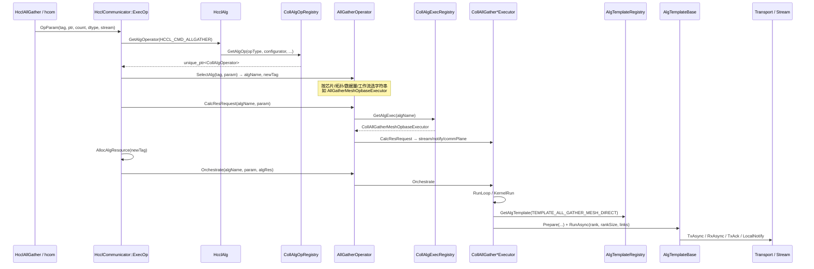

# HCCL 现有算法注册、实现与调用框架

> 源码：`gitee.com/ascend/cann-hccl`，`version.info = 8.3.T5.0`。  
> 路径前缀：`src/domain/collective_communication/`。

## 1. 设计目标与分层

HCCL 把一次集合通信拆成三层职责：

| 层 | 模块 | 职责 |
|---|---|---|
| 通信框架 | `framework/` | 通信域、资源申请、API 入口、Host/AICPU 展开 |
| 通信算法 | `algorithm/` | 算法选择、资源诉求计算、任务编排 |
| 通信平台 | 闭源 / toolkit | Transport、Notify、建链、SDMA/RDMA |

算法层内部再拆成三套可插拔组件，对应三次「按名字取实现」：

```
HcclCMDType  ──REGISTER_OP──►  CollAlgOperator   （选哪一种算法）
algName 字符串 ──REGISTER_EXEC──►  CollExecutorBase  （算资源、编排）
TemplateType ──REGISTER_TEMPLATE──►  AlgTemplateBase （在一个通信平面上步进）
```

这是一个**字符串/枚举驱动的工厂 + 虚函数编排**框架，而不是 C++ 模板组合框架。组合发生在运行期：Executor 的 `KernelRun` 里 `switch(algType)` 再 `GetAlgTemplate`。

## 2. 端到端调用链

以 Host 展开的 `HcclAllGather` 为例（图模式 / AICPU 展开路径类似，只是 Orchestrate 出口不同）。



关键源码锚点：

| 步骤 | 文件 | 符号 |
|---|---|---|
| API → ExecOp | `framework/communicator/impl/hccl_communicator_host.cc` | `HcclCommunicator::ExecOp` |
| 取 Operator | `algorithm/impl/hccl_alg.cc` | `HcclAlg::GetAlgOperator` |
| 选择算法名 | `algorithm/impl/operator/all_gather_operator.cc` | `AllGatherOperator::SelectAlg*` |
| 取 Executor | `algorithm/impl/operator/coll_alg_operator.cc` | `CollAlgOperator::{SelectAlg,CalcResRequest,Orchestrate}` |
| 资源计算骨架 | `algorithm/impl/coll_executor/coll_native_executor_base.cc` | `CollNativeExecutorBase::CalcResRequest` |
| 切分循环 | `algorithm/impl/coll_executor/coll_all_gather/coll_all_gather_executor.cc` | `CollAllGatherExecutor::Orchestrate / RunLoop` |
| 平面步进 | `algorithm/base/alg_template/temp_all_gather/all_gather_mesh_direct.cc` 等 | `RunAsync` |

`ExecOp` 的稳定顺序是：

1. `SelectAlg` 得到 `algName` + `newTag`（`newTag` 含 level1 算法名、host/device 后缀，用于资源缓存键）。
2. 若 `resMap_` 无该 tag：`CalcResRequest` → `AllocAlgResource`（建链、从流、notify、scratch）。
3. `Orchestrate`：按工作流（单算子 Loop / 图模式一次 / AICPU / AIV）下发任务。

## 3. 三套注册表

三套注册都是**静态初始化 + 单例 map/vector**。新算法通过在 `.cc` 末尾写宏完成接入，无需改工厂中心文件。

### 3.1 Operator 注册（按集合原语）

```44:62:algorithm/impl/operator/registry/coll_alg_op_registry.h
#define REGISTER_OP_HELPER(ctr, type, name, collOpBase)       \
    static HcclResult g_func_##name##_##ctr             \
        = CollAlgOpRegistry::Instance().Register(type, DefaultOpCreator<collOpBase>)
...
#define REGISTER_OP(type, name, collOpBase) REGISTER_OP_HELPER_1(__COUNTER__, type, name, collOpBase)
```

- Key：`HcclCMDType`（AllGather / ReduceScatter / AllReduce / AlltoAll / Broadcast / …）。
- Value：`CollAlgOpCreator`，构造 `CollAlgOperator` 派生类。
- 例：`REGISTER_OP(HcclCMDType::HCCL_CMD_ALLGATHER, AllGather, AllGatherOperator);`

Operator 的核心虚函数只有 `SelectAlg`：把「芯片 + 拓扑 + 数据量 + 工作流 + 环境变量」映射成 **Executor 字符串名**。

### 3.2 Executor 注册（按算法实例）

```44:50:algorithm/impl/coll_executor/registry/coll_alg_exec_registry.h
#define REGISTER_EXEC(tag, name, collExecBase) REGISTER_EXEC_HELPER_1(__COUNTER__, tag, name, collExecBase)
```

- Key：字符串，如 `"AllGatherMeshOpbaseExecutor"`。这是 Operator 与 Executor 之间的**唯一契约**。
- Value：`CollExecCreator`。
- 当前仓 **128** 条 `REGISTER_EXEC`。

Executor 必须实现：

- `CalcResRequest`：stream 数、notify 数、scratch、**按 CommPlane 的建链诉求**。
- `Orchestrate`：拿到 `AlgResourceResponse` 后编排。
- 可选：`GetAivExecParam` / `CalBlockDim` / 零拷贝分段 `KernelRunIntraServer*`。

### 3.3 Template 注册（按通信平面上的步进算法）

```44:48:algorithm/base/alg_template/alg_template_register.h
#define REGISTER_TEMPLATE(type, algTempBase) REGISTER_TEMPLATE_HELPER(__COUNTER__, type, algTempBase)
```

- Key：`TemplateType` 枚举（0–96 为内置，1000–2000 为自定义扩展）。
- Value：`AlgTemplateCreator`。
- Executor 通过 `AlgTemplateRegistry::Instance().GetAlgTemplate(type, dispatcher)` 拿到 `unique_ptr<AlgTemplateBase>`，再调用重载极多的 `Prepare(...)` + `RunAsync(rank, rankSize, links)`。

`AlgTemplateBase::Prepare` 在头文件中有 **1～12 个参数的十余个重载**，这是当前「组合点」最失控的地方：不同类型 Template 需要的流、切片、DMA 消减信息、AHC 分组都塞进同一基类。

## 4. 算法选择（Operator）

### 4.1 选择维度

`CollAlgOperator` 构造时从 `AlgConfigurator` 注入：

- 拓扑：`serverNum / moduleNum / superPodNum / deviceNumPerAggregation / topoType_`
- 算法偏好：`algType_`（level0/1/2 三元组），以及 `HCCL_ALGO` 是否覆盖 level1 默认策略
- 工作流：单算子 `OP_BASE` vs 图模式 `OPS_KERNEL_INFO_LIB`
- 芯片：`DEV_TYPE_910 / 910B / 910_93 / 310P3`，以及异构 `isDiffDeviceType_`

各 Operator 再按芯片拆 `SelectAlgfor910A/910B/91093/310P3/Mix`。以 AllGather 910B 为例，决策树大致为：

```
AIV 小数据？ → AllGatherMeshAivSmallCountExecutor
AIV 普通？   → AllGatherMeshAivExecutor
AIV+RDMA 跨机小数据？ → AllGatherAivRdmaExecutor
Mesh + 单算子 + 单 Mesh 域 → AllGatherMeshOpbaseExecutor
Mesh + Pipeline level1     → AllGatherMeshOpbasePipelineExecutor / GraphPipeline
Mesh 其他                  → AllGatherMeshExecutor / GraphExecutor
Ring 拓扑                  → AllGatherRingExecutor
兜底                       → AllGatherComm
```

910_93 则偏向 Double-Ring / Semi-Ring / ZeroCopy / AHC / NHR(level1)。

### 4.2 三级算法类型

```48:85:algorithm/pub_inc/common.h
enum class AlgTypeLevel0 { WHOLE_RING, 8P_RING, 4P_MESH, ..., NP_SINGLE_RING, NP_DOUBLE_RING, NP_MESH, ... };
enum class AlgTypeLevel1 { WHOLE_RING, HD, RING, PIPELINE, STAR, NHR, NHR_V1, NB, AHC, AHC_BROKE, ... };
enum class AlgTypeLevel2 { WHOLE_RING, HD, RING, NHR, NB, ... };
```

- **Level0**：Server / Die 内（HCCS Mesh 或 910_93 Double-Ring）。
- **Level1**：Server 间（同一 SuperPod 内，走 Clos / RoCE / HCCS 跨机）。
- **Level2**：SuperPod 间。

`AutoSelectAlgTypeLevel1` 用 α–β 模型在 Ring / HD / NHR / NB / Pipeline 间做代价估计；`HCCL_ALGO` 可强制指定。Executor 的 `desc_.level{0,1,2}SupportedAlgos` 会在 `SetAlgType` 时把不支持的选择**静默打回**第一个支持项。

### 4.3 通信平面

```19:31:algorithm/base/communicator/comm_utils.h
COMM_LEVEL0, COMM_LEVEL1, COMM_LEVEL2,
COMM_LEVEL1_AHC,
COMM_MESH_L0 / COMM_MESH_L1,
COMM_COMBINE / COMM_COMBINE_ORDER,
COMM_LEVEL{0,1}_ANYPATH_{SDMA,RDMA}
```

`CommType` 描述该平面上建什么样的图：`COMM_TAG_MESH`、`COMM_TAG_RING_INNER`、`COMM_TAG_NONUNIFORM_HIERARCHICAL_RING`、`COMM_TAG_ASYMMETRIC_HIERARCHICAL_CONCATENATE` 等。

**CLOS 的位置**：源码没有名为 `CLOS` 的 `AlgType` / `TemplateType`。机间 Clos 交换网被建模为 Level1/Level2 的连通图；其上跑的是 Ring / NHR / NB / HD / Pairwise / FullMesh。白皮书与 CANN 技术文章中的「Server 内 FullMesh、Server 间 Clos」即 **CLOS+Mesh 分层**，对应 Executor 里 `CalcLevel0(MESH) + CalcLevel1(RING/NHR/...)`。

## 5. Executor：资源计算与编排

### 5.1 类层次

```
CollExecutorBase
  └─ CollNativeExecutorBase     // CalcResRequest 骨架；KernelRun 钩子
       └─ CollCommExecutor      // 多环/多流/并发 SDMA+RDMA 公共编排（~2381 行）
            └─ CollAllGatherExecutor / CollReduceScatterExecutor / ...
                 └─ CollAllGatherMeshOpbaseExecutor 等 128 个叶子
```

`CollNativeExecutorBase::CalcResRequest` 固定流水线：

1. `ParseParam`
2. `CalcScratchMemSize` / `CalcStreamNum` / `CalcNotifyNum` / `CalcAivBufferRequest`
3. `CalcCommInfo` → `CalcLevel0/1/2CommInfo`
4. `BuildResourceRequest`

叶子 Executor 通常只覆盖其中几项 + `KernelRun`。

### 5.2 Orchestrate 与 Loop

以 AllGather 为例：

- 图模式：一次 `KernelRun`，直接用 user mem。
- 单卡：一次 `KernelRun`。
- 单算子：`RunLoop` 按 CCL buffer 切块，每块 `KernelRun`。
- 零拷贝：机间 `RunLoop`，机内 `KernelRunIntraServerPost`。

`DMAReduceFlag_` 控制是否把 user ptr 传给 Template，从而省略 CCL↔user 的额外拷贝。

### 5.3 KernelRun 的典型形态（分层）

`CollAllGatherRingFor91093Executor::KernelRun` 是分层算法的标准写法，被 AllReduce / ReduceScatter / Broadcast 的 910_93 Executor **几乎逐段复制**：

1. 取 `COMM_LEVEL0/1/2` 的 `SubCommInfo`。
2. 把本 rank 数据放到 output 的目标 offset（或 DMA 消减时从 user input 取）。
3. 若 `level2RankSize > 1`：选 NB/NHR/Ring Template 跑 SuperPod 间 AllGather。
4. 若 `level1RankSize > 1`：同样 switch 跑 Server 间。
5. Server 内：`MultiRingAllGather`（单环或双环）。

也就是说：**分层并没有被类型系统表达**，而是每个叶子里手写 L2→L1→L0。

### 5.4 CollCommExecutor：多 Channel 的集中地

`coll_comm_executor.cc`（2381 行）集中了：

- `MultiRingAllGather / ReduceScatter / AllReduce / Scatter / Gather`
- `MultiRing*Concurrent`（SDMA+RDMA AnyPath）
- `Level1*Concurrent`
- `MultiStreamReduceScatterMesh`（Mesh 多流）
- 双环 slice / ring order / NIC 映射

这是事实上的「多 channel 运行时」，但接口是一长串成员函数，而不是可组合的 Channel 策略对象。

## 6. Template：平面内步进

Template 按集合原语分子目录：`temp_all_gather`、`temp_reduce_scatter`、`temp_all_reduce`、`temp_broadcast`、`temp_scatter`、`temp_alltoall(v)` 等。

同一种拓扑在不同原语下各写一份：

| 拓扑 | AllGather | ReduceScatter | AllReduce | Broadcast | Scatter |
|---|---|---|---|---|---|
| Ring | `all_gather_ring.cc` | `reduce_scatter_ring.cc` | `all_reduce_ring.cc`（内部调 RS+AG） | `broadcast_ring.cc` | `scatter_ring.cc` |
| Mesh | mesh / mesh_direct / atomic / mix | 对应 5～6 份 | chunk_mesh / mesh_direct | mesh 走 Scatter+AG | `scatter_mesh.cc` |
| NHR | `all_gather_nhr.cc` (+v1) | `reduce_scatter_nhr.cc` (+v1) | nhr / nhr_oneshot / nhr_v1 | nhr / oneshot / v1 | `scatter_nhr.cc` |
| Double-Ring | `aligned_all_gather_double_ring.cc` | `aligned_reduce_scatter_double_ring.cc` (+SLC) | 走 Executor 组合 | — | `scatter_double_ring_direct.cc` |
| AHC | ahc / ahc_broke | ahc / ahc_broke | ahc / ahc_broke | — | — |

步进模式高度同构：

- **Ring**：`prev/next`，`p-1` 轮，每轮转发 `1/p` 切片；ReduceScatter 带 inline reduce。
- **Mesh**：对 `rankSize-1` 个对端各开一条从流，一轮全交换；Notify 做主从流同步。
- **NHR**：`GetRankMapping` 得到 `⌈log2 p⌉` 步的收发对与合并切片，再走与 Ring 类似的 Tx/Rx。
- **AHC**：组内 Template + 逻辑同号卡组间 Template，是当前唯一明确的「Template 组合 Template」。

AHC 已经展示了组合方向：`AllGatherAHC::RunInterAllGather` 通过 `GetInterAlgTemplateOpInstance` 取出 NB/NHR/Ring 实例再 `RunInstance`。缺的是把 Mesh/Ring/NHR/Clos 也提升为同样的可组合原语，而不是为每个 Op 再写一份。

## 7. 运行期对象生命周期

```
通信域 Init
  AlgConfigurator  → topoType + 默认 algType
  TopoInfoExtractor → CommPlaneRanks（level0/1/2 的 rank 分组）
  TopoMatcher       → 供 Executor 查询拓扑

每次集合通信
  Operator / Executor 按 newTag 缓存（resMap_）
  Template 每次 KernelRun 都 new 出来（unique_ptr），用完即毁
```

Template 的频繁堆分配发生在 **KernelRun 粒度**（单算子 Loop 的每一块一次），不在步进内。这是可接受的编排开销；真正的热路径是 `link->TxAsync/RxAsync` 与从流并发。重构时不得把步进内变成堆分配或额外虚调用链。

## 8. 与 AICPU / AIV 的关系

- **Host 展开**：上述 Orchestrate 在 Host 生成 task。
- **AICPU 展开**：`ExecOp` 走 `OrchestrateAicpu`，把 algName、通信域、stream 下到 Device；Device 侧 `aicpu_hccl_process.cc` 另有一份 `ALGCFG_TO_NAME`（如 `AllGather=level0:doublering` → `AlignedAllGatherDoubleRingFor91093Executor`）。
- **AIV**：Operator 选出 `*Aiv*Executor`，`desc_.isAivMode=true`，走 vector core kernel，不再走 Host Template 步进。

重构应保持 **algName 字符串契约**，以便 AICPU 配置表与现有环境变量继续工作。

## 9. 现有框架的结构性问题

1. **组合发生在运行期 switch，而不是类型系统**  
   128 个 Executor × 90+ Template，本质是 `Op ⊗ Topology ⊗ Chip ⊗ Mode` 的手工展开。

2. **Prepare 重载爆炸**  
   `AlgTemplateBase` 用函数重载模拟「不同算法的参数包」，类型上无法约束，调用点易错。

3. **分层逻辑复制**  
   910_93 的 AllGather / ReduceScatter / AllReduce / Broadcast / Reduce / Scatter 各自实现 L0/L1/L2 的 slice 公式与 Template 选择，仅切片偏移方向不同。

4. **多 Channel 未抽象**  
   双环、Mesh 多流、SDMA+RDMA concurrent、多 QP 都是「同一平面复制几份 transport + 几条 stream」，但代码路径完全分叉。

5. **CLOS 概念缺失**  
   文档/硬件是 Clos 网，代码只有 Mesh/Ring/NHR。机间 FullMesh、Pairwise、NHR 没有统一的 Clos 原语，导致 CLOS+Mesh 无法作为一等组合来写。

6. **性能相关的特化与算法骨架耦合**  
   DMA 消减、对齐双环、atomic Mesh、pipeline 切块都复制了一整份拓扑算法，而不是作为 Policy 挂在同一骨架上。

这些问题的量化与重构方案见 [02-algorithm-analysis-and-template-composition-refactor.md](./02-algorithm-analysis-and-template-composition-refactor.md)。

## 10. 附录：AllGather 已注册 Executor（示例）

AllGather 一族即可看出展开规模（其它原语同构）：

- Mesh：`AllGatherMeshExecutor` / `Opbase` / `Graph` / `OpbasePipeline` / `GraphPipeline` / `Aiv` / `AivSmall` / `AivFor91093` / `AivRdma`
- Ring：`AllGatherRingExecutor` / `RingFor91093` / `RingZerocopy` / `RingZerocopyExchange` / `SlimRingFor310P` / `For310P`
- Double-Ring：`AlignedAllGatherDoubleRingFor91093` / `DoubleRingConcurrent` / `SemiRing` / `SmallCount`
- 其它：`AllGatherComm` / `Mix` / `SioHccs` / `Single`

选择逻辑集中在 `AllGatherOperator::SelectAlgfor*`，执行逻辑分散在 20+ 个叶子文件中。
